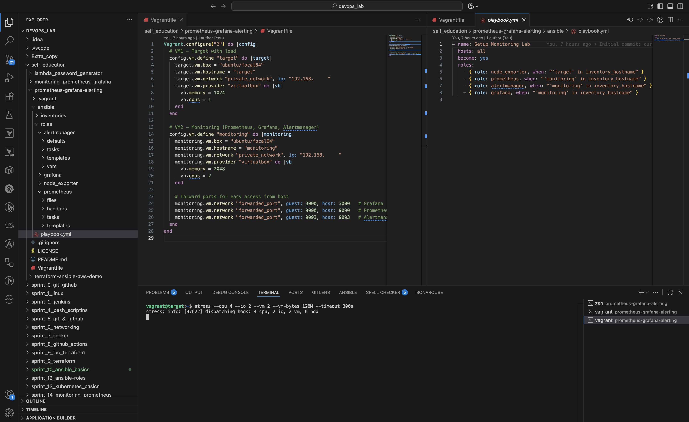
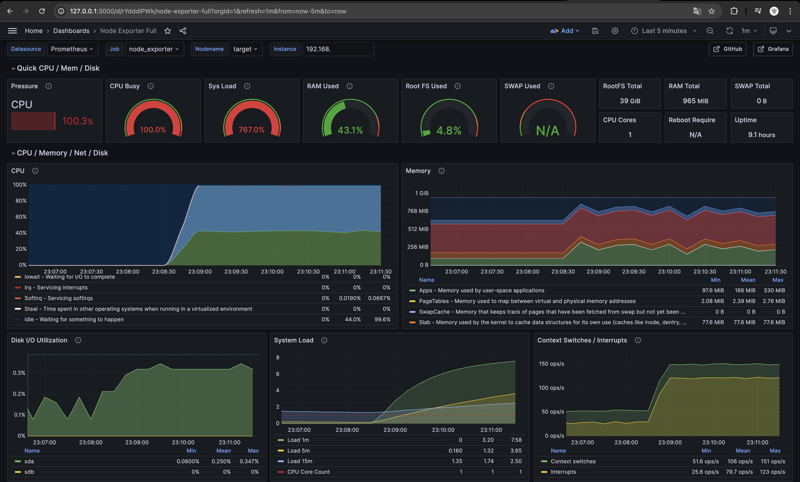
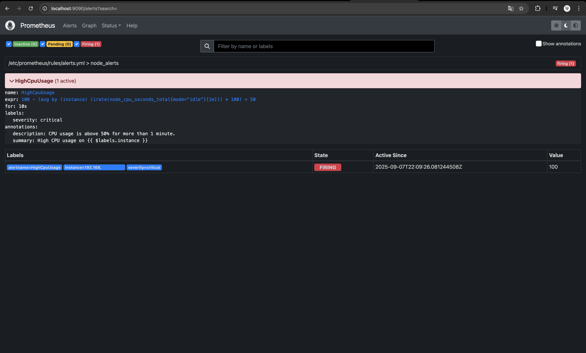
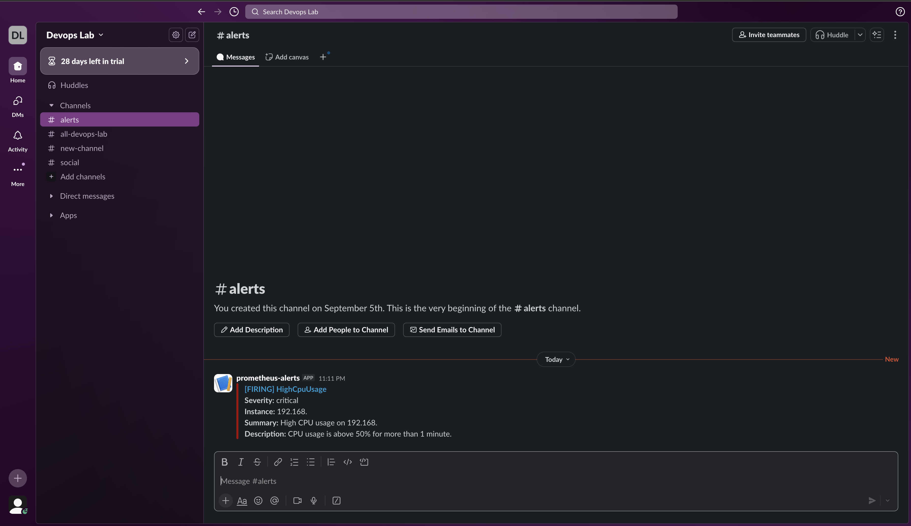

# Prometheus-Grafana Alerting Lab

This project was created for learning purposes, to reinforce knowledge of Prometheus, Grafana, Node Exporter, Alertmanager, and Ansible.

It is a demonstration project and not intended for production use.

## Project Structure

```
.
├── ansible
│   ├── inventories
│   │   └── hosts.ini.example
│   ├── playbook.yml
│   └── roles
│       ├── alertmanager
│       ├── grafana
│       ├── node_exporter
│       └── prometheus
├── LICENSE
├── README.md
└── Vagrantfile
```

## Components Installed

* **Node Exporter** – collects metrics from the target VM (`target`)
* **Prometheus** – collects and stores metrics
* **Alertmanager** – sends alerts (Slack Webhook can be configured via Vault)
* **Grafana** – dashboards for visualizing metrics

## Setup Instructions

1. Clone the repository:

```bash
git clone https://github.com/andriy1990/prometheus-grafana-alerting.git
cd prometheus-grafana-alerting
```

2. Create an inventory file for Ansible:

```bash
cp ansible/inventories/hosts.ini.example ansible/inventories/hosts.ini
# Edit IPs and private key paths if needed
```

3. Install required Ansible collections:

```bash
ansible-galaxy collection install community.grafana
```

4. Edit Vault secrets if needed:

```bash
ansible-vault edit ansible/roles/grafana/vars/vault.yml
ansible-vault edit ansible/roles/alertmanager/vars/vault.yml
```

## Running the Project

```bash
ansible-playbook -i ansible/inventories/hosts.ini ansible/playbook.yml --ask-vault-pass
```

* `target` VM – generates load (Node Exporter)
* `monitoring` VM – runs Prometheus, Alertmanager, Grafana

Access services in your browser:

* Grafana: `http://localhost:3000`
* Prometheus: `http://localhost:9090`
* Alertmanager: `http://localhost:9093`

## Alerts

* CPU overload on the `target` VM (>50% for 10 seconds) triggers the **HighCpuUsage** alert and sends notifications to Slack (if configured).

## Notes

This project is for educational purposes only. It helps to practice DevOps tools:

* Ansible
* Vagrant
* Prometheus / Grafana / Alertmanager
* Node Exporter

## Screenshots

### 1. Prometheus Dashboard


### 2. Grafana Dashboard Overview


### 3. Alertmanager Alerts


### 4. Stress Test Running in VSCode


## Let's Connect

I’m currently seeking DevOps opportunities in London, UK 🇬🇧.
Feel free to reach out or leave feedback!

[LinkedIn](https://www.linkedin.com/in/andriy-smyk-b5446311b)
